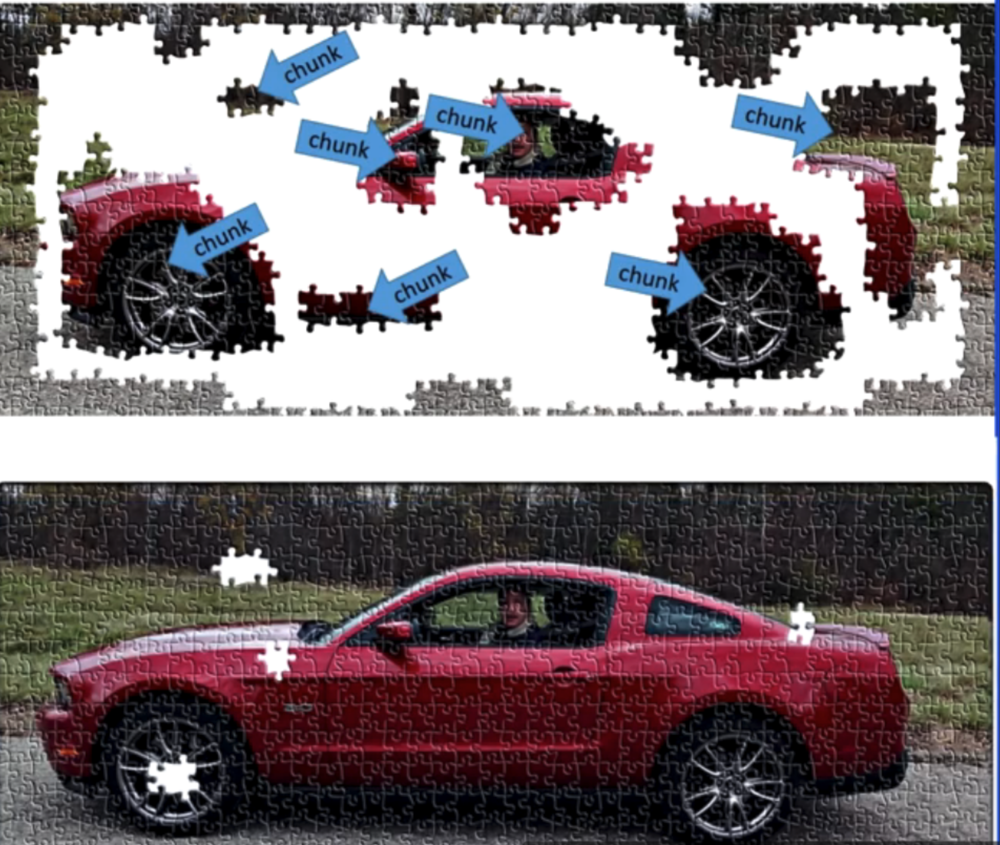
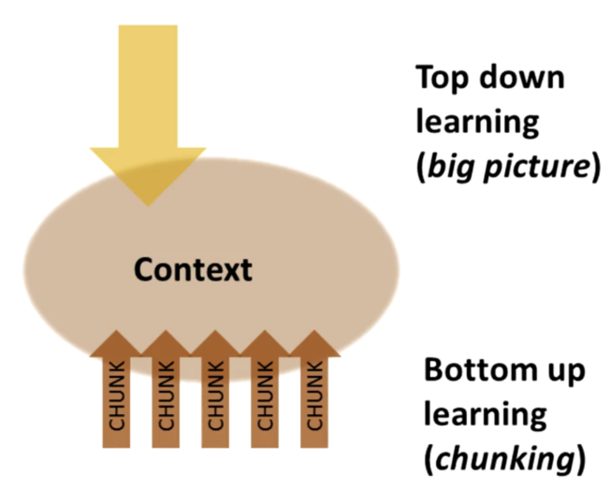

# Module 2: Chunking

### What You Will Learn in This Module:

- **What are Chunks?** – Understanding chunks as compact packages of information that are easy to access.
- **How to Form Chunks** – Techniques to effectively group information for better learning.
- **Using Chunks for Understanding & Creativity** – Leveraging chunking to deepen comprehension and enhance creative thinking.
- **Chunks & Test Performance** – How chunking can help improve exam results.
- **Illusions of Competence in Learning** – Recognizing and avoiding false confidence in understanding.
- **Challenges of Overlearning** – Understanding when overlearning is beneficial and when it becomes inefficient.
- **Advantages of Interleaving** – How mixing different types of problems or topics improves learning retention.

---

### **What Are Chunks?**

- **Chunks** are groups of information bound together through **use and meaning**.
- They form **compact neural networks**, making information easier to recall.
- **Bigger and more complex chunks** can still be stored as a **single unit** in working memory.

#### **2. How to Build Strong Chunks**

1. **Foucus**
   - watch & listen material with **undivided attention**
  
2. **Understand**
   - what is it?
   - know **how & when** to use it.
3. **Practice & recall**
   - recall what you've learned without looking at notes to strengthen memory.
   - Practice by yourself (don't just read or listen)
   - **Study in different locations** to make recall independent of specific environments.
4. **Learn again** if needed

---

### **The Value of a Library of Chunks**

- **Chunks help in learning new concepts through transfer**
  - When learning, your brain may connect new information with past experiences, recognizing **common patterns**.

------

### **Two Ways to Solve Problems**

1. **Sequential Approach (Step-by-step Thinking)**
   - Follows a **logical progression** from A → B → C.
   - Common in **focus mode** thinking.
2. **Holistic (Global) Approach**
   - **Intuitive problem-solving**, often involving the **diffuse mode** of thinking.
   - Allows for **big-picture insights** rather than strict step-by-step logic.

------

### **Law of Serendipity**

- *"Lady luck favors the one who tries."*
- Success often comes to those who take **consistent action**.
- No matter what you're learning:
  - Start by focusing on **Chapter 1**.
  - As you move to **Chapter 2**, it becomes easier because of the **foundation** you've built.

------

### **Two Key Learning Processes**

1. **Bottom-up Learning (Repetition & Practice)**
   - Strengthens **neural connections**.
   - Ensures quick and **easy recall** of the chunk.
2. **Top-down Learning (Big Picture Thinking)**
   - Helps you **see the relevance** of chunks in the broader context.
   - Connects different chunks together to form a **cohesive understanding**.

**Context = Where Bottom-up and Top-down Learning Meet**

#### **Transfer of Learning**

- Chunks from one area can **help learn related concepts** in another.
- **Interleaving** (mixing different concepts in one study session) improves learning flexibility.

---

### **Avoiding Illusions of Competence**

- **The Illusion of Competence**
   - Simply rereading material gives a false sense of mastery.
   - Looking at solutions and thinking "I understand this" does not mean true understanding.
   - Highlighting or underlining extensively can be misleading—active engagement is needed.
- **The Power of Recall**
   - After reading, look away and try to recall key ideas to reinforce learning.
   - Research by Jeffrey Karpicke shows that **recall is more effective than rereading**.
   - **Don't re-read before recall**, it doesn't work. Try to recall what you have just learned, write down what you don't understand and learn it again!
   - Tool: this course recommends using [iDoRecall](https://www.idorecall.com/) to create flashcards.

- **Chunking and Working Memory**
   - The brain has **limited working memory slots**.
   - Chunking information helps free up memory and makes recall easier.
   - Think of chunked concepts as **hyperlinks to deeper knowledge**.

- **The Importance of Self-Testing**
   - **Actively retrieving** information helps form strong neural connections.
   - **Mistakes during self-testing** are valuable—they highlight weak points for improvement.
   - Self-testing ensures you’re truly learning rather than fooling yourself.
   - mini test
     - After completing a chapter, take a mini test—it helps you recall what you've learned and identify what you still don't understand
  
- **Avoiding Environmental Dependency**
   - Learning in different environments prevents dependence on subliminal location cues.
   - Practicing recall **in various locations** helps adapt to test settings.

---

### **Overcoming Einstellung (Mental Fixation)**

- **Einstellung** occurs when prior knowledge **blocks** new, better solutions.
- Stay open to **new approaches** rather than relying on old patterns.

---

### **Law of Serendipity (Luck Favors Effort)**

- **Keep learning little by little**—progress comes through consistent effort.

---

### **Neuromodulators and Learning**

#### **1. Why Interest Affects Learning**

- Learning is easy when you're **interested** because your brain assigns **value and importance** to the information.
- Neuromodulators help determine **what is important** for long-term memory and motivation.

#### **2. Three Key Neuromodulators in Learning**

1. **Acetylcholine (ACh) – Focused Learning & Memory Formation**
   - **Helps with focus** and **synaptic plasticity** (how neurons strengthen connections).
   - Active when you are **paying close attention** and forming long-term memories.
2. **Dopamine – Motivation & Reward Learning**
   - Released when you get an **unexpected reward**.
   - Helps predict **future rewards**, motivating actions that **aren’t rewarding now** but will be in the future.
   - Plays a role in **decision-making** and **habit formation**.
   - Dopamine Imbalance:
     - Too much dopamine (from drugs) can cause **addiction**.
     - Too little dopamine can cause **anhedonia** (loss of interest) and **Parkinson’s disease** (lack of movement).
3. **Serotonin – Social Behavior & Emotion Regulation**
   - Higher serotonin = **higher social status & confidence** (seen in monkeys).
   - Low serotonin linked to **higher risk-taking behavior** and **violent crime**.
   - **Prozac increases serotonin** to treat depression.

#### **3. Emotions and Learning**

- **Emotions are deeply connected to cognition and memory.**
- The **amygdala**, part of the **limbic system**, integrates **emotion, decision-making, and memory**.
- Keeping your **amygdala happy** leads to **better learning**.

#### **4. Practical Applications**

- **Use rewards (dopamine) to stay motivated**: Treat yourself after study sessions.
- **Minimize distractions to engage acetylcholine**: Stay focused while learning.
- **Manage emotions**: Stress or negative emotions can hurt learning.

