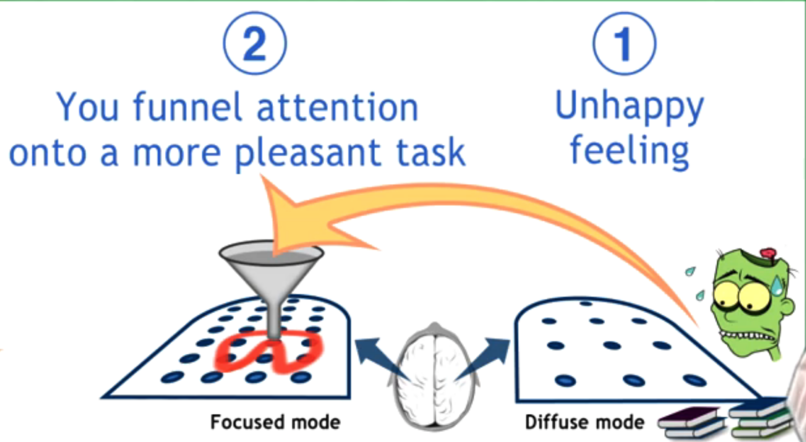

# Module 3: Procrastination and Memory

### What you will learn in this module
- The connection between **procrastination** and **memory** in the learning process
- How to build **solid chunks** in long-term memory for better recall.
- Why **managing procrastination** is crucial for effective learning.
- Best techniques to **access and strengthen long-term memory**.

---

### **1. Procrastination**

- **Definition:** Procrastination is the act of delaying or postponing tasks, often opting for short-term pleasure instead of long-term gains.
- **Causes of Procrastination:**
  - Instant gratification from distractions (e.g., social media, entertainment).
  - Fear of failure or difficulty in getting started.
  - Overestimation of future motivation.
  - Lack of clarity on how to proceed with a task.

#### **How to Overcome Procrastination**

- **Pomodoro Technique:**
  - Work in focused sprints (e.g., 25 minutes) followed by short breaks (5 minutes).
  - Helps reduce mental resistance and increase productivity.
- **Process vs. Product Thinking:**
  - Focus on the process of working rather than the end result.
  - Example: Instead of thinking, "I need to finish this entire essay," think, "I will write for 25 minutes."
- **Habit Formation:**
  - Identify triggers that lead to procrastination.
  - Replace negative habits with productive ones.
  - Reward yourself for completing small tasks.
- **Timed Planning:**
  - Set specific times to start tasks instead of vague deadlines.
  - Example: "I will start studying at 7 PM" instead of "I will study later."
- **Avoiding Multitasking:**
  - Focus on one task at a time to enhance deep work and retention.

---

### **2. The Science of Memory**

- **Short-Term vs. Long-Term Memory:**
  - Short-term memory holds limited information for a brief time.
  - Long-term memory stores information more permanently through repeated exposure.

#### **How to Strengthen Memory**

- **Spaced Repetition:**
  - Reviewing information at intervals helps reinforce memory.
  - Example: Reviewing notes after 1 day, 1 week, and 1 month.
  - Tool: [Anki](https://apps.ankiweb.net/) automate spaced repetition.
- **Active Recall:**
  - Testing yourself instead of passively rereading material.
  - Example: Using flashcards or practice quizzes.
- **Chunking:**
  - Grouping information into meaningful units.
  - Example: Memorizing a phone number in segments (123-456-7890 instead of 1234567890).
- **Interleaving:**
  - Mixing different types of problems or subjects in study sessions.
  - Example: Studying math, then switching to language learning, then revisiting math.
- **Elaborative Encoding:**
  - Connecting new knowledge with existing knowledge.
  - Example: Relating historical events to personal experiences or familiar stories.
- **Mnemonic Techniques:**
  - Using acronyms, rhymes, or images to aid recall.
  - Example: "PEMDAS" (Parentheses, Exponents, Multiplication/Division, Addition/Subtraction) for the order of operations.

---

### **3. The Connection Between Procrastination and Memory**

- **Procrastination weakens memory retention** because last-minute cramming overloads short-term memory, preventing deep encoding into long-term memory.
- **Effective time management** and regular review improve memory and reduce the stress associated with procrastination.

---

### **4. Practical Strategies for Learning and Retaining Information**

- **Create a study schedule:** Allocate specific times for reviewing different subjects.
- **Use visualization techniques:** Convert abstract information into mind maps or diagrams.
- **Teach others:** Explaining concepts reinforces understanding and memory.
- **Stay physically active:** Exercise enhances brain function and memory retention.
- **Get adequate sleep:** Sleep consolidates newly learned information into long-term memory.
- **Reduce distractions:** Study in an environment with minimal interruptions.

---

### **5. Make Plan**

#### **1. The Importance of Planning**

- **Weekly Planning**: Write a **brief list of key tasks** in a planner journal.
- **Daily Task List**:
  - Write it **the night before** to allow your subconscious to process tasks.
  - Helps free **working memory** for problem-solving.

#### **2. Structuring Your Task List**

- Keep it **short** (e.g., six items).
- Include both **process-oriented tasks** (e.g., daily study progress) and **product-oriented tasks** (doable in a short time).
- Add **reminders** to stay focused and enjoy the process.

#### **3. Balancing Work & Breaks**

- Add **physical activities** (e.g., cleaning, walking) as **diffuse mode breaks**.
- Helps avoid prolonged sitting and makes learning more enjoyable.
- Over time, you’ll **improve in estimating task durations** and become more efficient.

#### **4. Set a Quitting Time(IMPORTANT!!)**

- **Plan your finish time** (e.g., **5 PM**) to maintain work-life balance.
- Taking an evening break can **refresh learning** before sleep.
- Even top students like **Cal Newport** used a **5 PM quitting rule** and succeeded academically.
- **Hard work + leisure time = better long-term performance**.